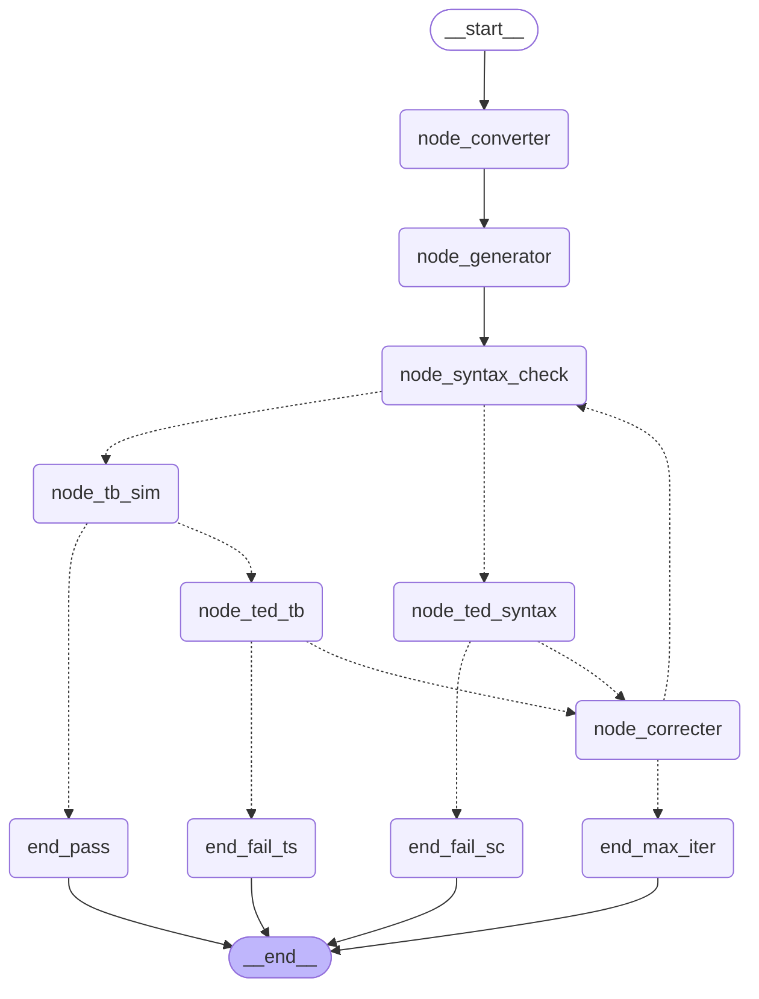

# Track 1 — COMBA LangGraph Pipeline: Walkthrough

## Tổng quan

Mở rộng LangGraph từ 2-node đơn giản (Converter → Generator) thành **pipeline verification đầy đủ** với 7 nodes, 5 conditional edges, rollback, EDTM, và iteration control.

## Graph Topology



**Đường thẳng** = edge cố định. **Đường đứt** = conditional edge (routing decision).

---

## Files tạo/sửa

| File | Vai trò |
|---|---|
| `comba_pipeline.py` | **Core**: COMBAState, 7 nodes, 5 routes, build_comba_graph() |
| `stub_llm.py` | StubLLM với 4 factory functions cho test |
| `test_pipeline.py` | 28 pytest tests (5 classes) |
| `prompts.py` | Thêm `correcterPromptTemplate` |

---

## 1. COMBAState — 20 Fields

Toàn bộ data flow đi qua một `TypedDict` duy nhất:

```python
class COMBAState(TypedDict):
    # Input
    nl_input: str                    # "Design an 8-bit adder"
    xml_description: str | None      # COMBA XML
    module_name: str | None          # "adder_8bit"

    # Verilog
    gvd: str | None                  # Generated Verilog (current)
    sgvd: str | None                 # Saved GVD (rollback snapshot)

    # Syntax Check
    sc_log: str | None               # Verilator raw stderr
    sc_exception: str | None         # Topmost %Error line
    sc_exception_count: int          # Số lỗi SC hiện tại
    sc_prev_exception_count: int     # Số lỗi trước khi sửa

    # Testbench
    tb_log: str | None               # TB simulation output
    tb_failure: str | None           # Topmost "TODO X Failed"

    # Debugging
    edp: str | None                  # Exception Debugging Prompt (SC)
    tdp: str | None                  # Testbench Debugging Prompt (TB)
    edtm: dict                       # {exception_sig: retry_count}

    # Control
    phase: str                       # "sc" | "ts"
    sc_trial: int                    # SC correction counter
    ts_trial: int                    # TS correction counter
    total_iter: int                  # Absolute counter
    rollback_triggered: bool

    # Result
    final_status: str | None         # "pass" | "fail_sc" | "fail_ts" | "max_iter"
```

---

## 2. Bảy Nodes — Giải thích từng node

### `node_converter` — NL → XML
- Gọi LLM với `converterPromptTemplate`
- Parse `<module id="...">` → `module_name`
- Skip nếu `xml_description` đã có

### `node_generator` — XML → Verilog
- Gọi LLM với `generatorPromptTemplate`
- Extract Verilog từ JSON / markdown / raw output
- Set `gvd` = `sgvd` (snapshot ban đầu cho rollback)

### `node_syntax_check` — Verilator lint-only
- Tạo temp dir, ghi `gvd` → `{module_name}.v`
- Chạy `verilator --lint-only -Wall -Wno-fatal -Wno-DECLFILENAME -Werror-UNDRIVEN -Werror-MULTIDRIVEN`
- Đếm `%Error` lines (bỏ "Exiting due to") → `sc_exception_count`
- Tăng `sc_trial`, `total_iter`

### `node_ted_syntax` — Topmost Exception Detection (SC)
- Lấy dòng `%Error` **đầu tiên** từ `sc_log` (topmost)
- Normalize thành signature (bỏ line numbers) cho EDTM
- Nếu signature đã thấy > `EDTM_MAX_RETRIES` (3) lần → thêm warning vào EDP
- Output: `edp` = prompt cho Correcter

### `node_correcter` — Fix code (SC hoặc TB)
- **Rollback Manager**: lưu `sgvd = gvd` trước khi sửa
- Gọi LLM với `correcterPromptTemplate({verilog_code, error_description, phase})`
- Nếu LLM trả code rỗng/ngắn < 20 chars → giữ nguyên code cũ
- Output: `gvd` mới + `sgvd` snapshot

### `node_tb_sim` — Verilator full compile + run
- 3 bước: `verilator --cc` → `make` → chạy binary
- Copy `tb.cpp` từ `modules/<name>/` nếu chưa có
- Detect failures: "TODO X Failed", "Assertion failed", non-zero exit
- Tăng `ts_trial`, `total_iter`

### `node_ted_tb` — Topmost Exception Detection (TB)
- Tìm pattern `TODO \d+ Failed` trong `tb_log`
- Thu thêm TRACE lines (INPUT/OUTPUT) cho context
- Output: `tdp` = prompt cho Correcter

---

## 3. Năm Conditional Edges

| # | Sau node | Điều kiện | → Đích |
|---|---|---|---|
| 1 | `syntax_check` | `sc_exception_count > 0` | `ted_syntax` |
|   |                | `sc_exception_count == 0` | `tb_sim` |
| 2 | `tb_sim`       | `tb_failure` có | `ted_tb` |
|   |                | `tb_failure` = None | `end_pass` ✅ |
| 3 | `ted_syntax`   | `sc_trial >= 10` | `end_fail_sc` ❌ |
|   |                | dưới limit | `correcter` |
| 4 | `ted_tb`       | `ts_trial >= 5` | `end_fail_ts` ❌ |
|   |                | dưới limit | `correcter` |
| 5 | `correcter`    | `total_iter >= 20` | `end_max_iter` ❌ |
|   |                | dưới limit | `syntax_check` (loop lại) |

---

## 4. Rollback Manager

Hoạt động bên trong `node_correcter`:

```
Trước sửa: sgvd = gvd, sc_prev = sc_exception_count
Sau sửa:   nếu sc_exception_count_mới > sc_prev → revert gvd = sgvd
```

**Mục đích**: LLM đôi khi "sửa 1 lỗi nhưng tạo 3 lỗi mới". Rollback ngăn code degrade.

## 5. EDTM (Exception-Debugging Trial Management)

```python
edtm = {"Signal 'result' not found": 3}  # đã thử 3 lần
```

- Mỗi exception signature được normalize (bỏ line number)
- Counter tăng mỗi lần gặp lại
- Sau `EDTM_MAX_RETRIES` (3): thêm warning vào EDP yêu cầu LLM thử cách khác
- Tránh infinite loop trên lỗi LLM không biết sửa

## 6. Iteration Control

| Giới hạn | Giá trị | Ý nghĩa |
|---|---|---|
| `MAX_SC_TRIALS` | 10 | Tối đa sửa syntax |
| `MAX_TS_TRIALS` | 5 | Tối đa sửa testbench |
| `MAX_TOTAL_ITER` | 20 | Hard cap tổng |

---

## Test Results

```
28 passed in 2.07s
```

| Test Class | Tests | Kết quả |
|---|---|---|
| `TestRoutingFunctions` | 10 | ✅ All pass |
| `TestNodes` | 7 | ✅ All pass |
| `TestE2EGraph` | 5 | ✅ All pass |
| `TestEDTM` | 2 | ✅ All pass |
| `TestState` | 2 | ✅ All pass |

E2E tests cover:
- **Happy path**: SC pass → TB pass → `final_status == "pass"`
- **SC fix path**: SC fail → TED → Correcter → SC pass → TB pass
- **Iteration limit**: Always buggy → hits `MAX_SC_TRIALS` → `fail_sc`
- **Rollback**: Correcter saves `sgvd` snapshot trước khi sửa
- **Graph structure**: 11 nodes đều có mặt

---

## Sử dụng

```bash
# Test với stub (không cần LLM/Verilator)
cd langgraph_core
python -m pytest test_pipeline.py -v

# Chạy pipeline thật (cần Verilator + LLM)
python comba_pipeline.py "Design an 8-bit adder with carry"

# Chạy với stub LLM (không cần LLM, vẫn cần Verilator)
python comba_pipeline.py --stub "Design an 8-bit adder"

# Visualize graph
python -c "
from stub_llm import create_stub_llm
from comba_pipeline import build_comba_graph
graph = build_comba_graph(create_stub_llm())
print(graph.get_graph().draw_mermaid())
"
```
